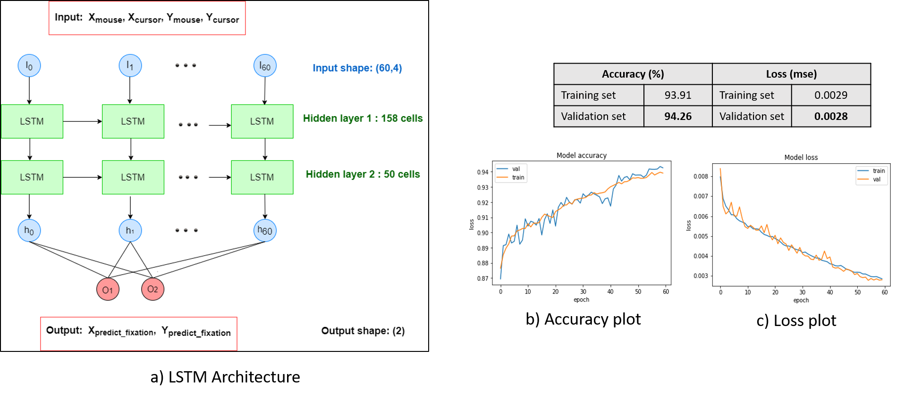
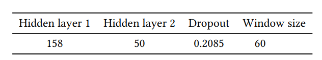
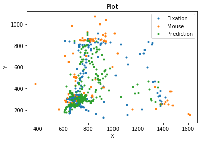
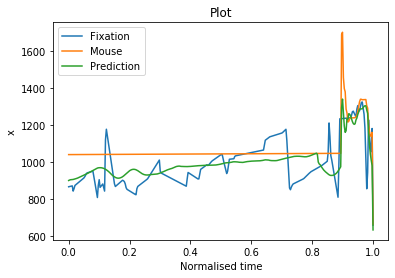

# Spatio Temporal Attention Prediciton
Fachpraktikum Machine learning and Computer vision laboratory for Human Computer Interaction

## Reference
1. Main paper to be cited ([Xu et al., 2016](https://perceptual.mpi-inf.mpg.de/files/2016/02/xu16_chi.pdf))
2. Python Code for evaluating salience metrics from https://github.com/imatge-upc/saliency-salgan-2017 and https://github.com/tarunsharma1/saliency_metrics

```
@inproceedings{basepaper,
author = {Xu, Pingmei and Sugano, Yusuke and Bulling, Andreas},
year = {2016},
month = {05},
pages = {3299-3310},
title = {Spatio-Temporal Modeling and Prediction of Visual Attention in Graphical User Interfaces},
doi = {10.1145/2858036.2858479}
}

```
## Abstract

Modeling visual attention helps in determining the behavior of users while they observe the most important regions in a visual scene. Existing methods of visual attention modeling mostly require an eye-tracking device. A computational model to predict users’ Spatio-temporal visual attention on WIMP-style (windows, icons,
  menus, pointer) graphical user interfaces solely using information available to the interface, such as users’ mouse, keyboard input and the UI components was proposed and successfully implemented in \cite{base-spatio-temporal}. Individual feature extraction processes for spatial and temporal attention models were performed and required a lot of time and resources. We propose to use a deep learning LSTM(Long-Short Term Memory) model for joint Spatio-temporal attention prediction, that is capable of handling huge time series data. Our LSTM model predicts attention maps more accurately and with lesser latency compared to our re-implementation of base paper

# Introduction

This repository contains code for the re-implementation of the static and dynamic attention prediction models mentioned in the paper. It also contains LSTM based models that extend the base model in static and dynamic predictions

## Requirements
* Python 3
* TensorFlow 
* Keras
* OpenCV

## Dataset:
This is provided by the department (from [Xu et al., 2016]). This is present in the GPU2 of the department.
For base re-implentation the mat files from the dataset should be placed in the Dataset folder, and the Static/Images folder need to be updated with images in the folder Static_Images placed in the GPU2 of the department

## BASE RE-IMPLEMENTATION - Usage and Configuration

The Orchestrator is used to orchestrate the interactions with the application. Currently, the orchestrator supports only the base re-implementation models. For LSTM usage, check the next section
The Orchestrator accepts two parameters: Service name, port name

Generic example:
>cd Spatio_Temporal_Attention_Prediciton
>python3 Orchhestrator.py (Service Name) (Port Name)

#### Supported services:
1. static : References the base Static Attention Prediction model
2. dynamic : References the base Dynamic Attention Prediction model
3. lstm_static : References the LSTM based Static Attention Prediction model
4. lstm_dynamic: References the LSTM based Dynamic Attention Prediction model
#### Supported ports:
1. dataset : creates the processed data required for training
2. train: Train the model
3. test: Test the model ( generate the prediction image )
4. quickeval: Quick evaluation of the model w.r.t the supported evaluation metrics
5. evalLatest: Evaluation performed after generating the dataset, training and prediction

Example, to call create dataset for static attention prediction model: 
> python3 Orchhestrator.py static dataset

To train: 
> python3 Orchhestrator.py static train

To test:
> python3 Orchhestrator.py static test

To evaluate:
>python3 Orchhestrator.py static quickeval


#### Configuration

The configuration file Config.json allows to configure few of the parameters which is used by the application. It can be extended further on

#### Static parameters:
#### Dynamic parameters
1. FeatureDimension : Dimension of the feature over time. The feature map can be calculated by 
( 2*FeatureDimension + 1)
#### LSTM Static parameters:
#### LSTM Dynamic parameters:

## LSTM MODEL - Usage and Configuration

## Overview:
  A LSTM model implementation for enhancing spatio-temporal attention modeling from ([Xu et al., 2016](https://perceptual.mpi-inf.mpg.de/files/2016/02/xu16_chi.pdf)) for graphical user interfaces.
  
## LSTM Model Architecture:



Hyperparameter optimization was performed using Bayesian optimization method to obtain the following model parameters:



**Loss: mse**


**Optimizer: RMSprop**


## Repo Usage:
1. Spatio-temporal_LSTM_model.ipynb : Data pre-processing, hyperparameter tuning, final model training and testing. Generated predictions to csv file.

2. LSTM_Spatial_Utility.ipynb and LSTM_Temporal_Utility.ipynb : code for generating images from predictions and obtaining corresponding attention maps.

3. LSTM_Spatial_SaliencyMetrics_Evaluation.ipynb and LSTM_Temporal_SaliencyMetrics_Evaluation.ipynb: Code to evaluate salience metrics 

## Results visualisation for LSTM Model:
Static attention prediction



Dynamic attention prediction



## Evaluations:

The evaluations for static and dynamic for the base re-implementation can be found as SalienceMericResults.txt file in their respective folders
The evaluations for LSTM dynamic predictions can be found in Temporal_Evaluation_metrics_lstm.xlsx in the LSTM directory
